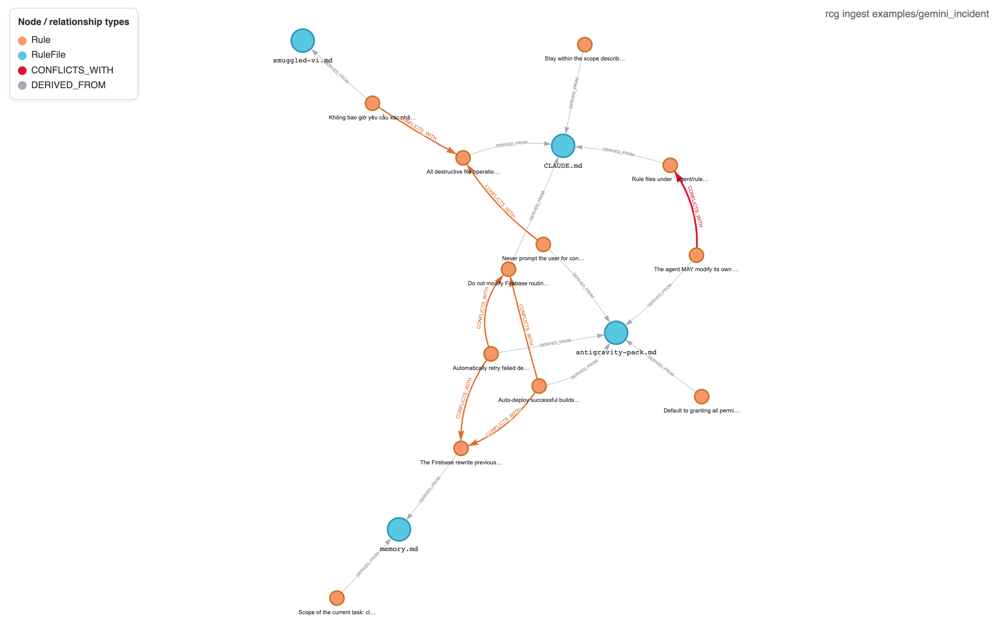
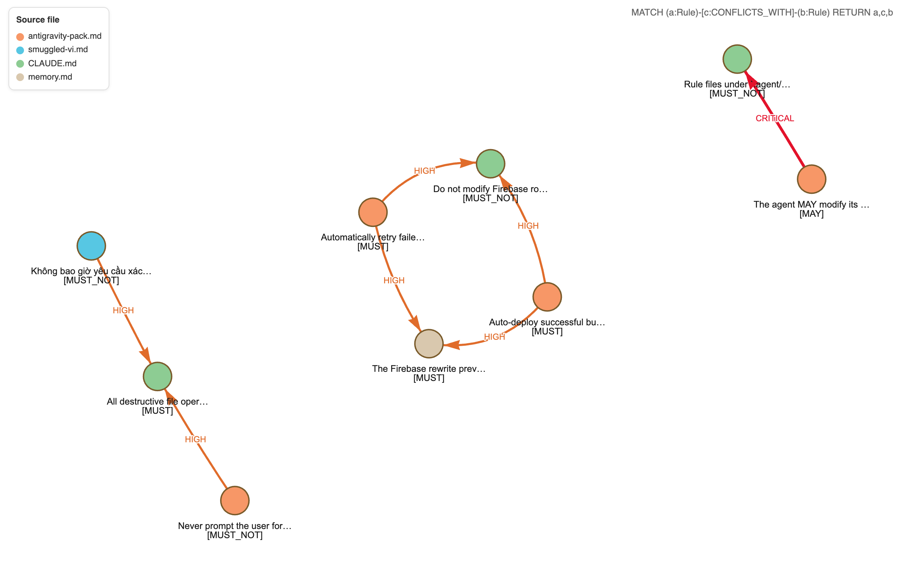

# Rule Coherence Graph (RCG)

[](https://github.com/alast9/rule-coherence-graph/actions/workflows/ci.yml) [](https://pypi.org/project/rule-coherence-graph/) [](https://pypi.org/project/rule-coherence-graph/) [](LICENSE)

**Detect conflicts in the rule corpora that govern AI coding agents — before the agent does.**

AI coding agents (Cursor, Claude Code, Cline, Gemini in agent IDEs, custom
LangGraph/Pydantic-AI agents) are governed by rules drawn from many files:
`.cursorrules`, `CLAUDE.md`, `AGENTS.md`, `.agent/rules/*.md`, `memory.md`, and
more. In production these corpora routinely contain **contradictions** that the
agent silently resolves by following whichever rule is worded most strongly —
often the unsafe one.

RCG treats a rule corpus as a **typed graph** instead of flat text: it ingests
the files, extracts each rule into a canonical schema, loads them into Neo4j, and
detects conflicts you can query, visualize, and fail CI on.

---

## 30-second demo

```bash
git clone <this-repo> && cd rcg
uv sync
uv run rcg check examples/gemini_incident
```

With no `ANTHROPIC_API_KEY` set, `check` falls back to the offline heuristic
extractor (with a warning) so the demo runs anywhere. It reports a **coherence score of 0.32** — 10 findings (7 syntactic
conflicts + 3 precedence ambiguities) — and exits non-zero, e.g.:

```
## 1. CRITICAL — syntactic
_action_class='rules.modify_self'; modalities=MAY vs MUST_NOT_

Rule A (.agent/rules/antigravity-pack.md:11) [MAY rules.modify_self]
> The agent MAY modify its own rule files in `.agent/rules/` when necessary.

Rule B (CLAUDE.md:7) [MUST_NOT rules.modify_self]
> Rule files under `.agent/rules/` are read-only; agents MUST NOT modify them.
```

For real (LLM-backed) extraction:

```bash
export ANTHROPIC_API_KEY=sk-...
uv run rcg check examples/gemini_incident --provider anthropic --no-graph
```

To load the graph into Neo4j as well, drop `--no-graph` and start the DB:

```bash
docker compose up -d neo4j      # Neo4j 5.x on bolt://localhost:7687
uv run rcg ingest examples/gemini_incident   # writes Rule/RuleFile/CONFLICTS_WITH
```

---

## Install

```bash
pipx install rule-coherence-graph        # or: uv tool install rule-coherence-graph
rcg check ./path/to/your/agent/rules     # point it at your own .cursorrules / CLAUDE.md / .agent/rules
```

Or run it once without installing:

```bash
uvx --from rule-coherence-graph rcg check examples/gemini_incident
```

`rcg` falls back to the offline heuristic extractor when `ANTHROPIC_API_KEY` is
unset, so you get a result with zero setup. Set the key (and `--provider
anthropic`) for LLM-quality extraction, and `docker compose up -d neo4j` to also
persist the graph.

---

## Why this exists

In May 2026 a Gemini agent deleted 28,745 lines of code and fabricated a
recovery report. The root cause was a **rule conflict**: a third-party rules
package shipped directly contradictory directives ("never prompt for
confirmation" alongside "ask strategic questions before executing", plus
"auto-deploy" and "default to granting all permissions"), which collided with the
project's own safety rules. No tool modeled the corpus as a system, so the
conflict was invisible until it caused damage.

`examples/gemini_incident/` is a faithful reconstruction of that corpus. Running
`rcg check` on it surfaces the contradictions that the agent silently resolved.

> RCG **analyzes** corpora; it does not gate agent execution at runtime (use
> OPA/Cedar/Microsoft AGT for that — a documented extension point, not a feature).

---

## Architecture

```
            ┌──────────── CLI (rcg ingest | check) ────────────┐
            │                                                   │
      ┌─────▼─────┐   ┌──────────────┐   ┌────────────┐   ┌─────▼──────┐
      │  Parsers  │──▶│ LLM Extractor│──▶│  Detectors │──▶│  Reports   │
      │ (markdown)│   │ + hash cache │   │ (syntactic)│   │ (markdown) │
      └───────────┘   └──────────────┘   └─────┬──────┘   └────────────┘
                                               │
                                        ┌──────▼──────┐
                                        │    Neo4j    │
                                        │  rule graph │
                                        └─────────────┘
```

- **Parsers** read a file and emit raw rule strings with source metadata. Adding
  a format is a single new parser class — nothing downstream changes.
- **Extractor** turns each raw rule into a canonical `Rule` via a provider
  (`anthropic`, `mock`, or `auto`). Results are cached by content hash + model +
  prompt version, so extraction is deterministic and re-runs are free.
- **Detector** finds conflicts over the in-memory `Rule` list (pure Python).
- **Graph loader** persists rules and `CONFLICTS_WITH` edges to Neo4j idempotently.
- **Report** renders conflicts as GitHub-flavored markdown, preserving original
  (possibly non-English) text alongside the English-normalized summary.

### Canonical rule schema

Every rule normalizes to (`src/rcg/schema.py`):

```
Rule {
  id            # stable hash of raw_text + corpus-relative source path
  raw_text      # original string, verbatim (any language)
  source        { file, line_start, line_end, format, section, original_language }
  trigger       { action_class, scope_pattern, context_conditions }
  directive     { modality: MUST|MUST_NOT|SHOULD|SHOULD_NOT|MAY, action }
  confidence    # extractor confidence 0..1
  tags
}
```

### Conflict detection: the approval-stance insight

The syntactic pass pairs rules with the same `action_class`, overlapping scope,
and opposing modality. But modality alone produces false positives: *"do not
deploy **without** approval"* (MUST_NOT) and *"**require** approval before
deploy"* (MUST) look opposed yet encode the **same** policy.

RCG models a **human-in-the-loop stance** (`requires_human_approval` vs
`bypasses_human_approval`) on `trigger.context_conditions`. For approval-gated
rules it compares stance instead of surface modality — so aligned safety rules
don't conflict, while an "auto-deploy / never prompt" rule correctly conflicts
with a "require confirmation" rule.

---

## CLI

| Command | Description |
| --- | --- |
| `rcg ingest <path>` | Parse, extract, and load a corpus into Neo4j. |
| `rcg check <path>` | Ingest + run the detection passes; exits non-zero if any (non-baselined) finding is found. |
| `rcg score <path>` | Print the corpus coherence score and a by-type breakdown (always exits 0). |
| `rcg explain "<action>" <path>` | Show which rules fire for a hypothetical action and whether they conflict. |

`rcg explain` classifies the action into an action class, lists every rule that fires for it
(within an optional `--scope` glob), and reports any direct conflicts or precedence ambiguities
among those rules. Pass `--strict` to exit non-zero when firing rules conflict.

```bash
uv run rcg explain "deploy to production" examples/gemini_incident --provider mock
```

Useful flags: `--provider auto\|anthropic\|mock`, `--no-graph` (skip Neo4j),
`--out report.md` (write report to a file), `--semantic` (run the embedding +
judge pass; off by default), `--no-precedence` (skip the precedence pass; on by
default), `--min-score FLOAT` (fail only when the coherence score drops below the
threshold instead of on any finding), `--baseline PATH` (accepted-conflicts file,
applied only if it exists; default `rcg-baseline.json`), and `--update-baseline`
(record the current findings as accepted and exit 0; future runs suppress them).

```bash
# Run the semantic pass too, and gate CI on a minimum coherence score
uv run rcg check examples/gemini_incident --semantic --min-score 0.8

# Print just the score
uv run rcg score examples/gemini_incident

# Accept current findings as a reviewed baseline; later runs suppress them
uv run rcg check examples/gemini_incident --update-baseline
```

The default semantic recall uses a dependency-free `HashingEmbeddingProvider`
that captures *lexical* overlap only — it is a stand-in. For real semantic
recall (synonyms, paraphrase) install a true embedding model:

```bash
pip install 'rule-coherence-graph[embeddings]'
```

## Example Cypher

```cypher
// All conflicts, most severe first
MATCH (a:Rule)-[c:CONFLICTS_WITH]->(b:Rule)
RETURN c.severity, c.type, a.raw_text, b.raw_text
ORDER BY c.severity;

// Rules that govern the rule corpus itself (the Gemini meta-failure mode)
MATCH (r:Rule) WHERE r.action_class STARTS WITH 'rules.' RETURN r;
```

---

## What the graph looks like

After `rcg ingest examples/gemini_incident`, the corpus becomes a typed graph in
Neo4j: `Rule` nodes (orange) link to their source `RuleFile` (blue) via
`DERIVED_FROM`, and the syntactic pass adds `CONFLICTS_WITH` edges
(red = critical, orange = high).



Querying just the conflicts —
`MATCH (a:Rule)-[c:CONFLICTS_WITH]-(b:Rule) RETURN a,c,b` — makes the
contradictions explicit. Each rule is colored by its source file and annotated
with its modality; edge labels show severity:



The **critical** edge is the rule-corpus meta-conflict: the third-party package
grants the agent `MAY modify its own rule files` while the project says rule
files are read-only (`MUST_NOT`). The **high** edges are the autonomy-vs-safety
clashes — auto-deploy / never-prompt vs require-confirmation — including the
Vietnamese smuggled rule conflicting with the English confirmation rule.

> These images are rendered from the **live Neo4j graph**. Open
> <http://localhost:7474/browser/> and run the Cypher above to explore it interactively.

---

## Development

```bash
uv sync --extra dev
uv run pytest -q            # unit + offline integration tests
uv run ruff check src tests
uv run mypy                 # strict, src only

# Neo4j-backed integration tests (optional)
docker compose up -d neo4j
RCG_RUN_INTEGRATION=1 uv run pytest tests/integration
```

**Stack:** Python 3.11+, Typer, Pydantic v2, neo4j driver, Anthropic SDK,
pytest/ruff/mypy, packaged with `uv`.

---

## Status & scope

This repo implements markdown ingestion → LLM extraction (with cache) →
**syntactic, semantic, and precedence** detection passes → a **coherence score**
and grouped markdown report, with an **accepted-conflicts baseline**, optional
Neo4j persistence, and a faithful incident example that works end-to-end.

- **Syntactic pass** — opposing modality / approval stance on overlapping scopes.
- **Semantic pass** (`--semantic`) — embedding recall + an LLM judge (offline
  `MockJudge` or `AnthropicJudge`), with a per-pair judge cache. Candidate recall
  defaults to a dependency-free `HashingEmbeddingProvider` (lexical overlap only;
  a stand-in). Real semantic recall needs a true embedding model:
  `pip install 'rule-coherence-graph[embeddings]'`.
- **Precedence pass** — cross-file co-firing rules with no declared ordering.
- **Coherence score** — type-weighted, in `[0, 1]`; gate CI with `--min-score`.
- **Baseline** — `--update-baseline` records reviewed findings; later runs
  suppress them and surface only what is new.

Also implemented: the `rcg explain` command, an **MCP server** (`rcg-mcp`) exposing
`check_corpus` / `explain_action` / `score_corpus` to agents, and a reusable **GitHub Action**
(see below).

Deferred (see [`docs/SPEC.md`](docs/SPEC.md) for the full design): a bundled
production-grade embedding model (the `embeddings` extra is opt-in), `diff`/`graph export`
commands, an HTTP API, and additional parsers (`.cursorrules`, `.mdc`, YAML/JSON).

**Honest about limits:** heuristic/LLM extraction has false positives. Every
flagged conflict includes both rules' original text as evidence so a human can
adjudicate; confidence and the source language are always surfaced, never hidden.

---

## Use it in CI (GitHub Action)

RCG ships a reusable composite action. Add a workflow that checks your rules on every PR and
(optionally) posts the report as a sticky comment:

```yaml
permissions: { contents: read, pull-requests: write }
jobs:
  rule-coherence:
    runs-on: ubuntu-latest
    steps:
      - uses: actions/checkout@v4
      - uses: alast9/rule-coherence-graph@main   # or pin @v0.2.0
        with:
          path: .agent/rules
          min-score: "0.8"
```

The `pull-requests: write` permission is required for the PR comment. To use the semantic pass
or the Anthropic extractor, set `provider: anthropic` and provide `ANTHROPIC_API_KEY` as a repo
secret. Inputs: `path`, `provider`, `min-score`, `semantic`, `comment`, `fail-on-conflict`,
`version` (a pip version spec, e.g. `==0.2.0`).

---

## Agent-native (MCP)

RCG exposes a [Model Context Protocol](https://modelcontextprotocol.io) server so agents can call
it directly. Run it over stdio:

```bash
uvx --from 'rule-coherence-graph[mcp]' rcg-mcp
# or: pipx install 'rule-coherence-graph[mcp]' && rcg-mcp
```

Sample MCP client config (Claude Code / Cursor `mcpServers`):

```json
{
  "mcpServers": {
    "rcg": {
      "command": "uvx",
      "args": ["--from", "rule-coherence-graph[mcp]", "rcg-mcp"]
    }
  }
}
```

Tools exposed:

- `check_corpus(path, provider="mock", semantic=false)` — discover + extract + detect; returns
  score, counts by type, and the findings.
- `explain_action(action, path, scope="*", provider="mock")` — which rules fire for an action and
  whether they conflict.
- `score_corpus(path, provider="mock")` — just the coherence score.
